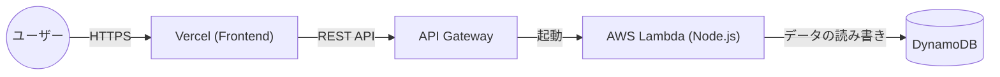
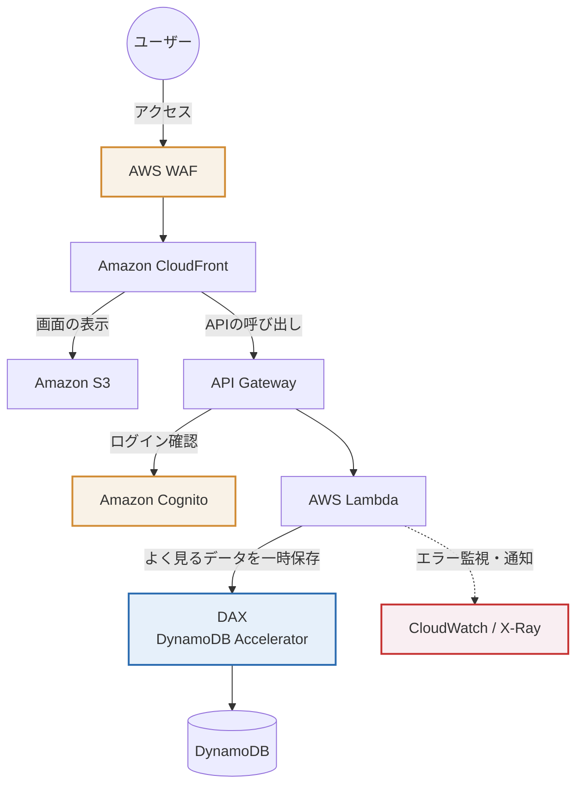

# ポートフォリオ

インフラ構築からフロントエンドのデプロイまで担当しました。
実際のサイトや使った技術については以下のとおりです。
読んでいただけると幸いです！

## 🚀 デモサイト
**[こちらから実際に動作を確認いただけます] (https://snippet-portfolio.vercel.app/)**
※データの保存・取得がリアルタイムに行えます。
※ドメイン取得はお金がかかるのでやめました。

## 🚀 アピールポイントと開発の工夫
### 1. インフラの完全コード化（AWS CDK × Terraform）
AWSの管理画面からの手作業は一切行わず、**AWS CDK (TypeScript)** を使ってインフラを自動構築できるようにしています。
管理画面のUIが変わっていて、しばらく開発から離れていたことを実感させられました。
Terraformの理解もあることを示すため、**Terraform** でも同じ構成を作れるコード（`infra-tf/`フォルダ）を用意し、IaCの使い分けができる状態にしました。

### 2. フルスタックでのCRUD実装とCORSの解決
フロントエンド（Vercel）とバックエンド（AWS API Gateway + Lambda + DynamoDB）を連携させたサーバーレス構成です。
* **CORSエラーへの対応:** 異なるドメイン間の通信で発生するCORSエラーに対し、API Gatewayのメソッド設定（OPTIONS, PUT, DELETE等）を正しく構成して解決しました。エラーの特定がしばらくできず時間がかかりました。
* **簡易セキュリティの実装:** データの「新規作成」や「取得」は誰でもできる一方、「編集（PUT）」や「削除（DELETE）」の破壊的な操作には、パスワード入力を求める仕組みをLambda側に実装し、安全性を考慮しました。パスワードは「akari」です。特に深い意味はありません。

### 3. 使いやすさ（UI/UX）とレスポンシブ対応へのこだわり
ユーザーが迷わず、心地よく使えるデザインを目指しました。AppleのHuman Interface GuidelinesをAIに読み込ませて、フロント側を修正しました。
* **スマホ対応とレイアウト崩れの防止:** 長いコードを入力しても画面が横に伸びないよう、CSS Gridの仕様を調整（`minmax`の活用など）し、スマホでもPCでも綺麗に横スクロールするレスポンシブデザインを実装しています。
* **分かりやすい画面の動き:** API通信中（保存や削除の処理中）はボタンを「処理中」にして連打を防ぎ、終わったあとはトースト通知（画面下のポップアップ）で結果を分かりやすく伝えています。
* **ユーザーに優しい機能:** 画面のテーマカラーを6色から選べる機能や、初回訪問時のチュートリアル（Driver.js）、コードを綺麗に色付けする機能（Highlight.js）などを取り入れました。表示タイミングの管理や順序の調整だったりが地味に難しかったです。

## 🛠 使った技術
今回は2つのIaCツールを採用し、同じインフラを構築・管理できる構成にしています。
* Frontend: HTML5, CSS3, JavaScript (Vercelでホスティング)
* Backend: Node.js, TypeScript (AWS Lambda)
* Database: Amazon DynamoDB
* Infrastructure: AWS CDK (Infrastructure as Code) , Terraform
* API: Amazon API Gateway

## 📂 フォルダ構成
* frontend/: ブラウザ用ソースコード
* app/: AWS Lambda用ロジック（TypeScript）
* infra-cdk/: AWS CDK用定義
* infra-tf/: Terraform用定義

## 🏗 Architecture (構成図)

### 1. 現在の構成（個人開発・スモールスタート向け）
まずは最速で動くものを重視し、維持費がほぼ無料に収まるシンプルなサーバーレス構成にしています。

### 2. 大規模化を見据えた構成
もしこのアプリを、月間数万人以上が利用するサービスとして育てていく場合、以下のような構成にアップグレードすることを想定しています。

### スケールアップに向けた具体的な設計の変更点
* **セキュリティと負荷対策 (AWS WAF / CloudFront)**
現在はVercelを使っていますが、AWSに統一してS3とCloudFrontでの配信に切り替えます。入り口にWAFを置き、悪意のある攻撃や異常なアクセスからシステムを守ります。

* **ログイン機能 (Amazon Cognito)**
現在の共通パスワードを廃止し、Amazon Cognitoを導入します。ユーザーごとにアカウントを作り、自分が投稿したスニペットだけを編集・削除できるという一般的なWebサービスの形にします。

* **データベースの高速化 (Amazon DAX)**
「みんながよく見る人気コード」などにアクセスが集中するとデータベースの負荷が上がるため、DynamoDBの手前にDAXを置き、表示スピードの向上とコスト削減を両立させます。

* **システムの監視とエラー対応 (CloudWatch / X-Ray)**
利用者が増えると、どこでエラーが起きているかの特定が難しくなります。AWS X-Rayを入れて処理の遅れを視覚化し、エラーが起きたらCloudWatch経由で開発者のSlackに自動で通知がいく仕組みを作ります。