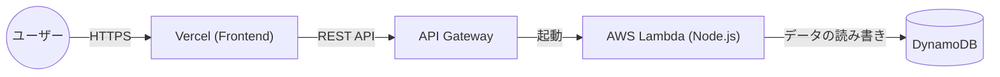
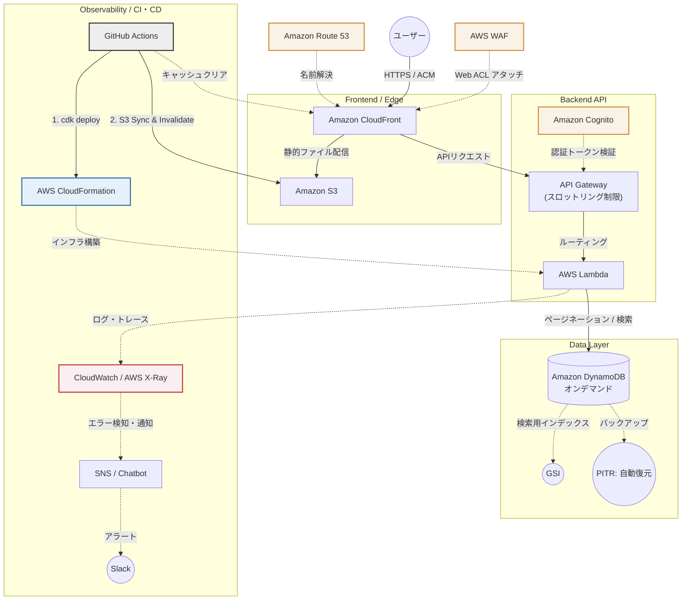

# ポートフォリオ

インフラ構築からフロントエンドのデプロイまで担当しました。
実際のサイトや使った技術については以下のとおりです。
読んでいただけると幸いです！

---

## 🌐 デモサイト
**[こちらから実際に動作を確認いただけます] (https://snippet-portfolio.vercel.app/)**

* データの保存・取得・編集・削除をリアルタイムに行えます。
* コスト削減のため、独自ドメインではなくホスティングサービスを使用しています。

---

## 🚀 アピールポイントと開発の工夫

### 1. インフラの完全コード化（AWS CDK × Terraform）
AWSの管理画面からの手作業は一切行わず、**AWS CDK (TypeScript)** を使ってインフラを自動構築できるようにしています。

またTerraformの理解もあることを示すため、**Terraform** でも同じ構成を作れるコード（`infra-tf/`フォルダ）を用意し、IaCの使い分けができる状態にしました。

### 2. フルスタックでのCRUD実装とCORSの解決
フロントエンド（Vercel）とバックエンド（AWS API Gateway + Lambda + DynamoDB）を連携させたサーバーレス構成です。

* **CORSエラーへの対応:** 異なるドメイン間の通信で発生するCORSエラーに対し、API Gatewayのメソッド設定（OPTIONS, PUT, DELETE等）を正しく構成して解決しました。エラーの特定がしばらくできず時間がかかりました。
* **簡易セキュリティの実装:** データの「新規作成」や「取得」は誰でもできる一方、「編集（PUT）」や「削除（DELETE）」の破壊的な操作には、パスワード入力を求める仕組みをLambda側に実装し、安全性を考慮しました。パスワードは「akari」です。

### 3. 使いやすさ（UI/UX）とレスポンシブ対応へのこだわり
ユーザーが迷わず、心地よく使えるデザインを目指しました。AppleのHuman Interface GuidelinesをAIに読み込ませて、フロント側を修正しました。
* **スマホ対応とレイアウト崩れの防止:** 長いコードを入力しても画面が横に伸びないよう、CSS Gridの仕様を調整（`minmax`の活用など）し、スマホでもPCでも綺麗に横スクロールするレスポンシブデザインを実装しています。
* **分かりやすい画面の動き:** API通信中（保存や削除の処理中）はボタンを「処理中」にして連打を防ぎ、終わったあとはトースト通知（画面下のポップアップ）で結果を分かりやすく伝えています。
* **ユーザーに優しい機能:** 画面のテーマカラーを6色から選べる機能や、初回訪問時のチュートリアル（Driver.js）、コードを綺麗に色付けする機能（Highlight.js）などを取り入れました。表示タイミングの管理や順序の調整だったりが地味に難しかったです。

---

## 🛠 使った技術
今回は2つのIaCツールを採用し、同じインフラを構築・管理できる構成にしています。
* Frontend: HTML5, CSS3, JavaScript (Vercelでホスティング)
* Backend: Node.js, TypeScript (AWS Lambda)
* Database: Amazon DynamoDB
* Infrastructure: AWS CDK (Infrastructure as Code) , Terraform
* API: Amazon API Gateway

---

## 📂 フォルダ構成
* frontend/: ブラウザ用ソースコード
* app/: AWS Lambda用ロジック（TypeScript）
* infra-cdk/: AWS CDK用定義
* infra-tf/: Terraform用定義

---

## 🏗 構成図

### 1. 現在の構成（個人開発レベル）
まずは最速で動くものを重視し、維持費がほぼ無料に収まるシンプルなサーバーレス構成にしています。

```mermaid
graph LR
    User((ユーザー)) -->|HTTPS| Vercel["Vercel (Frontend)"]
    Vercel -->|REST API| APIGW[API Gateway]
    APIGW -->|起動| Lambda["AWS Lambda (Node.js)"]
    Lambda -->|データの読み書き| DDB[(DynamoDB)]
```

### 2. 大規模化を見据えた構成
もしこのアプリを、月間数万人以上が利用するサービスとして育てていく場合、以下のような構成にアップグレードすることを想定しています。

```mermaid
graph TD
    %% DNS & アクセス
    DNS[Amazon Route 53] -.->|名前解決| CF[Amazon CloudFront]
    User((ユーザー)) -->|HTTPS / ACM| CF
    WAF[AWS WAF] -.->|Web ACL アタッチ| CF

    %% フロントエンド配信
    subgraph "Frontend / Edge"
        CF -->|静的ファイル配信| S3[Amazon S3]
    end

    %% バックエンドAPIと認証
    subgraph "Backend API"
        CF -->|APIリクエスト| APIGW["API Gateway <br> (スロットリング制限)"]
        Cognito[Amazon Cognito] -.->|認証トークン検証| APIGW
        APIGW -->|ルーティング| Lambda[AWS Lambda]
    end

    %% データベース
    subgraph "Data Layer"
        Lambda -->|ページネーション / 検索| DDB[("Amazon DynamoDB<br>オンデマンド")]
        DDB -.->|検索用インデックス| GSI((GSI))
        DDB -.->|バックアップ| PITR((PITR: 自動復元))
    end

    %% 運用保守・監視・デプロイ
    subgraph "Observability / CI・CD"
        Lambda -.->|ログ・トレース| CW["CloudWatch / AWS X-Ray"]
        CW -.->|エラー検知・通知| SNS["SNS / Chatbot"]
        SNS -.->|アラート| Slack((Slack))
        
        GitHub["GitHub Actions"] -->|1. cdk deploy| CFN[AWS CloudFormation]
        CFN -.->|インフラ構築| Lambda
        
        GitHub -->|2. S3 Sync & Invalidate| S3
        GitHub -.->|キャッシュクリア| CF
    end

    %% スタイリング
    style WAF fill:#f9f2e7,stroke:#d18c35,stroke-width:2px
    style Cognito fill:#f9f2e7,stroke:#d18c35,stroke-width:2px
    style CFN fill:#e6f0fa,stroke:#2b6cb0,stroke-width:2px
    style CW fill:#f9eef2,stroke:#c53030,stroke-width:2px
    style GitHub fill:#eeeeee,stroke:#333333,stroke-width:2px
    style DNS fill:#f9f2e7,stroke:#d18c35,stroke-width:2px
```

### 💡 スケールアップを見据えた設計思想

数万人規模のユーザーが利用する商用サービスを想定した場合、「コスト」「パフォーマンス」「運用保守」の観点から以下の設計を取り入れます。

#### 1. パフォーマンスとスケーラビリティ（大量データへの対応）
* **バックエンド主導の検索とページネーション:** 現在は「全データを取得してフロントエンドで絞り込み」を行っていますが、データ量が増えるとブラウザの負荷とDBの読み取りコストが増大するかと思いますので、DynamoDBにGSIを追加し、API側で10件ずつデータを返すページネーション設計に変更します。
* **VPCレスな自動スケール:** トラフィック増に対しては、DynamoDBのオンデマンドキャパシティで対応します。DAXなどのキャッシュサービスは導入せず、保守負担の少ない純粋なサーバーレス構成を貫くことで、コストと運用効率のバランスを取ります。※特定のデータに秒間数千人が殺到するレベルでないとそれらのキャッシュサービスの導入によるメリットは少ないとのこと。

#### 2. セキュリティとブランド保護（堅牢なシステム）
* **ネットワークとAPI保護:** Route 53とACMを用いて独自ドメインとSSL通信を確立します。また、CloudFrontにAWS WAF（Web ACL）をアタッチ、API Gatewayでスロットリング制限を設定し、サービスの安定性を向上させます。
* **本人確認:** Amazon Cognitoを導入し、「自分が作成したデータのみ操作できる」認可の仕組みをAPI Gatewayに組み込みます。
* **データ復旧体制:** DynamoDBのPITRを有効化し、過去35日間の任意の1秒前にデータを復元できる体制を整えます。

#### 3. 運用・保守の効率化（監視と自動化）
* **オブザーバビリティの確保:** AWS X-Rayによる分散トレーシングでボトルネックを特定。CloudWatchアラームで異常を検知し、即座に開発者のSlackへ通知する体制にします。
* **正確なCI/CDパイプライン:** GitHub Actionsの責務を明確に分離します。Lambdaなどのバックエンドインフラは `cdk deploy` (CloudFormation経由) で安全にプロビジョニングし、フロントエンドは直接S3へ同期後、CloudFrontのキャッシュ削除を行う正しいリリースフローを構築します。
