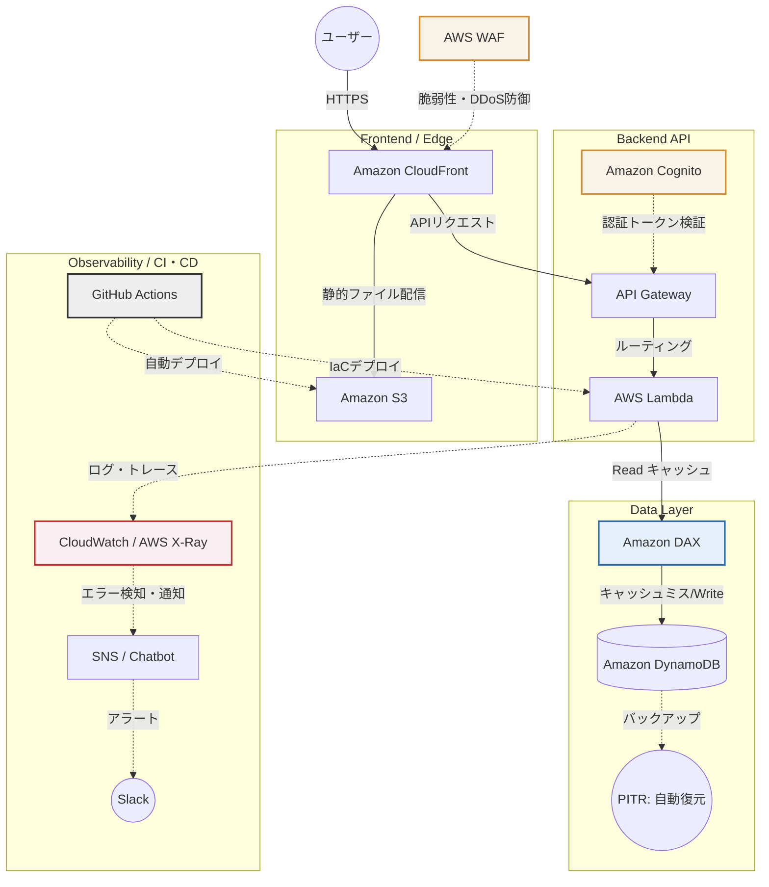

# ポートフォリオ

インフラ構築からフロントエンドのデプロイまで担当しました。
実際のサイトや使った技術については以下のとおりです。
読んでいただけると幸いです！

## 🚀 デモサイト
**[こちらから実際に動作を確認いただけます] (https://snippet-portfolio.vercel.app/)**
※データの保存・取得がリアルタイムに行えます。
※ドメイン取得はお金がかかるのでやめました。

## 🚀 アピールポイントと開発の工夫
### 1. インフラの完全コード化（AWS CDK × Terraform）
AWSの管理画面からの手作業は一切行わず、**AWS CDK (TypeScript)** を使ってインフラを自動構築できるようにしています。
管理画面のUIが変わっていて、しばらく開発から離れていたことを実感させられました。
Terraformの理解もあることを示すため、**Terraform** でも同じ構成を作れるコード（`infra-tf/`フォルダ）を用意し、IaCの使い分けができる状態にしました。

### 2. フルスタックでのCRUD実装とCORSの解決
フロントエンド（Vercel）とバックエンド（AWS API Gateway + Lambda + DynamoDB）を連携させたサーバーレス構成です。
* **CORSエラーへの対応:** 異なるドメイン間の通信で発生するCORSエラーに対し、API Gatewayのメソッド設定（OPTIONS, PUT, DELETE等）を正しく構成して解決しました。エラーの特定がしばらくできず時間がかかりました。
* **簡易セキュリティの実装:** データの「新規作成」や「取得」は誰でもできる一方、「編集（PUT）」や「削除（DELETE）」の破壊的な操作には、パスワード入力を求める仕組みをLambda側に実装し、安全性を考慮しました。パスワードは「akari」です。特に深い意味はありません。

### 3. 使いやすさ（UI/UX）とレスポンシブ対応へのこだわり
ユーザーが迷わず、心地よく使えるデザインを目指しました。AppleのHuman Interface GuidelinesをAIに読み込ませて、フロント側を修正しました。
* **スマホ対応とレイアウト崩れの防止:** 長いコードを入力しても画面が横に伸びないよう、CSS Gridの仕様を調整（`minmax`の活用など）し、スマホでもPCでも綺麗に横スクロールするレスポンシブデザインを実装しています。
* **分かりやすい画面の動き:** API通信中（保存や削除の処理中）はボタンを「処理中」にして連打を防ぎ、終わったあとはトースト通知（画面下のポップアップ）で結果を分かりやすく伝えています。
* **ユーザーに優しい機能:** 画面のテーマカラーを6色から選べる機能や、初回訪問時のチュートリアル（Driver.js）、コードを綺麗に色付けする機能（Highlight.js）などを取り入れました。表示タイミングの管理や順序の調整だったりが地味に難しかったです。

## 🛠 使った技術
今回は2つのIaCツールを採用し、同じインフラを構築・管理できる構成にしています。
* Frontend: HTML5, CSS3, JavaScript (Vercelでホスティング)
* Backend: Node.js, TypeScript (AWS Lambda)
* Database: Amazon DynamoDB
* Infrastructure: AWS CDK (Infrastructure as Code) , Terraform
* API: Amazon API Gateway

## 📂 フォルダ構成
* frontend/: ブラウザ用ソースコード
* app/: AWS Lambda用ロジック（TypeScript）
* infra-cdk/: AWS CDK用定義
* infra-tf/: Terraform用定義

## 🏗 Architecture (構成図)

### 1. 現在の構成（個人開発・スモールスタート向け）
まずは最速で動くものを重視し、維持費がほぼ無料に収まるシンプルなサーバーレス構成にしています。

### 2. 大規模化を見据えた構成
もしこのアプリを、月間数万人以上が利用するサービスとして育てていく場合、以下のような構成にアップグレードすることを想定しています。

### 💡 スケールアップを見据えた設計思想

数万人規模のユーザーが利用する商用サービスを想定した場合、以下の3点を軸にシステムの信頼性を高める設計を行っています。

#### 1. 可用性と冗長性
* **マルチAZの活用:** CloudFront、API Gateway、Lambda、DynamoDBを組み合わせることで、特定のデータセンターに障害が起きてもサービスが止まらない高可用性を実現します。
* **アクセス急増への自動対応:** ユーザーが急激に増えても、Lambdaの並列実行やDynamoDBの自動キャパシティ調整により、システムが自動で処理能力を拡張します。手動でのサーバー増設作業は一切不要です。

#### 2. セキュリティとデータ保護
* **攻撃対策:** CloudFrontの入り口にAWS WAFを配置します。これにより、悪意のある攻撃（SQLインジェクションやDDoS攻撃など）がシステムの奥深くまで届く前にブロックします。
* **本人確認:** 簡易パスワードを廃止し、Amazon Cognitoを導入します。各ユーザーに固有のアカウントを発行し、自分が作成したデータだけを操作できるという安全な権限管理を徹底します。
* **データ消失の対策:** 誤操作やプログラムのバグによるデータ消失に備え、DynamoDBのPITRを有効化します。過去35日間のうち、任意の1秒前の状態までいつでもデータを復元できる体制を整えます。

#### 3. 運用・保守を楽に
* **エラーの見える化:** 大規模になると原因特定が難しくなるため、AWS X-Rayを導入して処理の遅れを可視化します。また、異常を検知した際はCloudWatchを通じて即座に開発者のSlackへ通知が飛ぶようにし、トラブルにすぐ気づける環境を作ります。
* **CI/CD化:** GitHub Actionsを活用し、プログラムをGitHubにPushするだけで「自動テスト」と「AWSへのデプロイ」が完結する仕組みを構築します。これにより、人の手によるミスを完全に防ぎ、安全かつスピーディーに新機能を追加できるようにします。